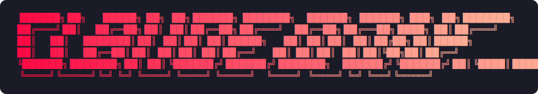

<p align="center">
  
</p>

# Claude Done

[English](./README.md) | 中文

用 Claude Code 写代码时，你做了哪些决策、踩了哪些坑、理清了哪些思路——关掉终端就全没了。Claude Done 帮你留住这些。

两个技能。一个保存，一个回顾。就这么简单。

## 工作原理

- **`/done`** — 将当前会话的结构化摘要保存到 `~/.claude-done/`
- **`/recall`** — 搜索和浏览你过去的会话摘要

摘要以纯 Markdown 文件存储，命名和结构保持一致。随着时间推移，你会积累一个可搜索的知识库——记录你做过的每个决策、排除的方案、解决的问题，以及下一步计划。

## 安装

### 通过插件市场
在 Claude Code 中，先注册市场：
```
/plugin marketplace add Genuifx/claude-done
```
然后从市场安装插件：
```
/plugin install claude-done@done
```

### 验证

在新的 Claude Code 会话中：
- `/done` — 应该会提示保存会话摘要
- `/recall` — 应该能搜索你的历史摘要

## 工作流程

```
做点什么 → /done → 摘要已保存

第二天 → /recall → 从上次中断的地方继续
```

1. **正常使用** Claude Code
2. 收工时执行 **`/done`** — Claude 会回顾整个对话并记录：
   - 完成了什么、关键决策
   - 探索过的替代方案及其被否决的原因
   - 遇到的问题及解决方式
   - 提出的问题（已解决和未解决的）
   - 变更的文件和下一步计划
3. 在未来的会话中执行 **`/recall`** 搜索历史
   - 关键词搜索：`/recall auth flow`
   - 按日期：`/recall last 7 days`
   - 按分支：`/recall branch feat-auth`
   - 最近记录：不带参数的 `/recall` 列出最新条目

## 保存内容

每条摘要是 `~/.claude-done/` 中的一个 Markdown 文件，结构如下：

**文件名：** `2026-02-18_feat-auth_a1b2c3d4_fix-token-refresh.md`

```markdown
# 修复 Token 刷新逻辑

**日期：** 2026-02-18
**分支：** feat-auth
**会话：** a1b2c3d4-...

## 摘要
排查并修复了 token 刷新的竞态条件...

## 关键决策
- 改用基于 mutex 的锁方案——比队列方案更简单
- 保留 v1 token 的向后兼容——迭代中期迁移风险太大

## 变更内容
- `src/auth/refresh.ts` — 在刷新调用周围添加了 mutex 锁
- `src/auth/token.ts` — 将 TTL 缓冲从 30s 延长到 60s

## 问题与解决方案
- 并发请求下的竞态条件——通过 mutex 模式解决

## 待解决问题
- 刷新失败时是否需要添加重试逻辑？（未解决）

## 下一步
- [ ] 为并发刷新场景添加集成测试
- [ ] 部署后监控错误率
```

空的章节会自动省略。

## 技能参考

| 技能 | 触发方式 | 功能 |
|------|---------|------|
| **done** | `/done`、"wrap up"、"save session" | 回顾完整对话并写入结构化摘要 |
| **recall** | `/recall`、"search history"、"what did we do last time" | 按关键词、日期、分支或时间搜索 `~/.claude-done/` |

### Recall 搜索选项

| 参数 | 示例 | 说明 |
|------|------|------|
| `--keyword` | `--keyword "auth flow"` | 全文搜索所有摘要 |
| `--date` | `--date today`、`--date 7d`、`--date 2026-01:2026-02` | 按日期范围筛选 |
| `--branch` | `--branch feat-auth` | 按分支名筛选（模糊匹配） |
| `--last` | `--last 5` | 显示最近 N 条记录 |

参数可组合使用：`--keyword auth --date 7d`

## 设计理念

- **会话是短暂的，知识不应该是。** 每次会话都有值得保留的上下文——决策、死胡同、突破。`/done` 在它们消失前捕获下来。
- **结构胜于混乱。** 一致的格式意味着你的第 50 条摘要和第 1 条一样容易搜索。
- **两个命令，零摩擦。** 无需配置、无需设置、无需改变工作流。只有 `/done` 和 `/recall`。
- **纯文件，完全掌控。** 一切都以 Markdown 形式存放在 `~/.claude-done/`。`grep`、`git`、备份——随你处置。

## 致谢

灵感来自 [@shadcn](https://x.com/shadcn/status/2023812711151259772)。

## 许可证

MIT
